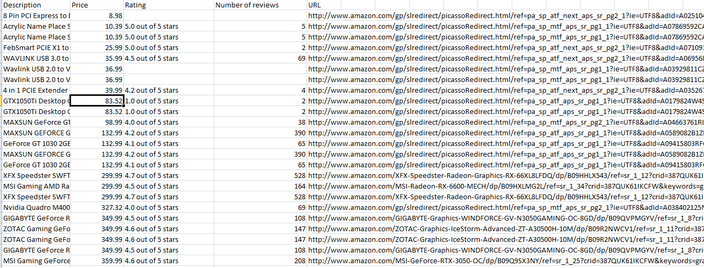
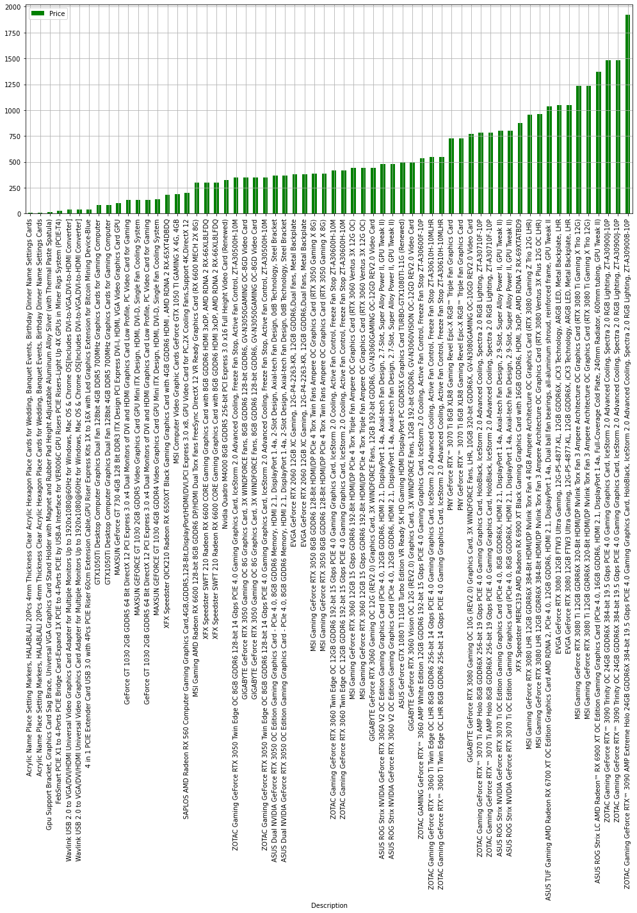

# Amazon Web Scraper
Purpose of this program is to scrape information of searched results on www.amazon.com. 
This program scrapes information about product description, price, rating and review count. 
Also, program displays a graph with compared prices of searched results. 

# How it works
User can enter desirable search term of any category inside brackets of program's main function in string format, and modify the program by specifying the number of search pages within which the program will search for results. The program will automatically open up the program-controlled browser that searches for the entered search term independently.When finished, the program saves the data from searched results to a results.csv file, located in the program's folder, and displays a graph with a comparison of prices of the search results. The program is tested with Jupyter Notebook and VSCode Interactive mode. 

# How this program can help you?
This program can help you with the tracking of prices of your desirable category or product of interest. 

# Further improvements
This program can be improved by making it more user-friendly:
<ul>
  <li> The user can be asked by a prompt for a search term and number of pages to look in for, for that specific search term. </li>
  <li> The program can be made as a web application with user interface, displaying two input fields for information listed above. In the same app, the user will have an overview of scraped data and a graph made out of it.</li>
</ul>
 

# Images of the program in use

<b>results.csv file:<b>
 

<b>Visualization of the data:<b>
 
